# Papliba Corp Organizational Hierarchy

Papliba Corp is a dynamic gaming organization. This README outlines its hierarchical structure as represented in Backstage YAML files.

---

## **Organization**

### Papliba Corp
- Description: The Papliba Corp, a gaming organization.
- [Website](http://www.papliba.com/) | [Intranet](https://meta.wikimedia.org/wiki/)
- **C-Suite Executives**:
  - CEO: Chief Executive Officer
  - CFO: Chief Financial Officer
  - COO: Chief Operating Officer
  - CTO: Chief Technology Officer
  - CHRO: Chief Human Resources Officer
  - CMO: Chief Marketing Officer

---

## **Departments**

### Administrative and Support Services
- HR: Human Resources
- Finance: Finance Department
- Legal: Legal Department

### Operations and Production
- Supply Chain: Supply Chain Management
- Logistics: Logistics Department
- Quality Assurance: Quality Assurance Department

### Technology and Development
- IT: Information Technology
- R&D: Research and Development

### Sales and Customer Relations
- Sales: Sales Department
- Customer Support: Customer Support
- Account Management: Account Management

### Marketing and Communication
- Marketing: Marketing Department
- PR: Public Relations
- Corporate Communications: Corporate Communications

### Strategic and Business Development
- Business Development: Business Development
- Strategy: Strategy Team

### Specialized Teams
- Data Analytics: Data Analytics Team
- ESG: Environmental, Social, and Governance
- Risk Management: Risk Management Team
- IP Management: Intellectual Property Management

---

## **Hierarchy Diagram**

Below is the hierarchy diagram representing Papliba Corp:

```mermaid
graph TD
  A[Papliba Corp]
  A --> B[C-Suite Executives]
  B --> B1[CEO]
  B --> B2[CFO]
  B --> B3[COO]
  B --> B4[CTO]
  B --> B5[CHRO]
  B --> B6[CMO]
  A --> C[Administrative and Support Services]
  C --> C1[HR]
  C --> C2[Finance]
  C --> C3[Legal]
  A --> D[Operations and Production]
  D --> D1[Supply Chain]
  D --> D2[Logistics]
  D --> D3[Quality Assurance]
  A --> E[Technology and Development]
  E --> E1[IT]
  E --> E2[R&D]
  A --> F[Sales and Customer Relations]
  F --> F1[Sales]
  F --> F2[Customer Support]
  F --> F3[Account Management]
  A --> G[Marketing and Communication]
  G --> G1[Marketing]
  G --> G2[PR]
  G --> G3[Corporate Communications]
  A --> H[Strategic and Business Development]
  H --> H1[Business Development]
  H --> H2[Strategy]
  A --> I[Specialized Teams]
  I --> I1[Data Analytics]
  I --> I2[ESG]
  I --> I3[Risk Management]
  I --> I4[IP Management]
```



---

## **Backstage Integration**

### **Groups Defined in Backstage**

- Each department and team is defined as a `Group` in Backstage YAML format.
- Relationships are established using `children` fields to build a comprehensive hierarchy.

### **Location YAML**

```yaml
apiVersion: backstage.io/v1alpha1
kind: Location
metadata:
  name: papliba-groups
  description: A collection of all Papliba Corp Groups
spec:
  targets:
    - ./administrative-support.yaml
    - ./operations-production.yaml
    - ./technology-development.yaml
    - ./sales-customer-relations.yaml
    - ./marketing-communication.yaml
    - ./strategic-business-development.yaml
    - ./specialized-teams.yaml
```

---

Feel free to explore the individual YAML files for detailed configurations of each team and department.
